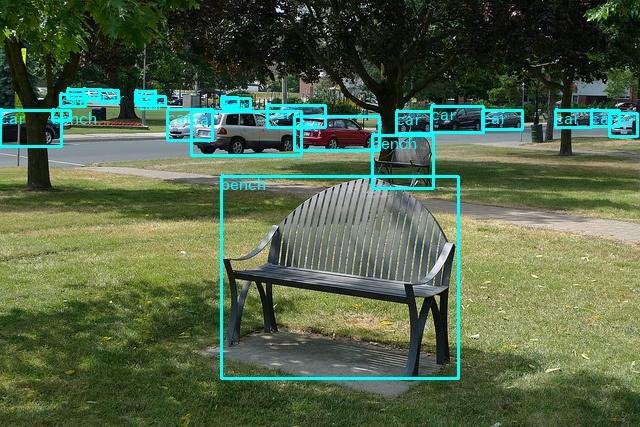

# DETR Turtorial

## Data preparation
To download the dataset, please refer to [prepare_data.md](../prepare_data.md).

### COCO format
To use coco data to train detection, you can refer to [configs/detection/detr/detr_r50_8x2_150e_coco.py](https://github.com/alibaba/EasyCV/tree/master/configs/detection/detr/detr_r50_8x2_150e_coco.py) for more configuration details.

## Get Started

To immediately use a model on a given input image, we provide the Predictor API. Predictor group together a pretrained model with the preprocessing that was used during that model's training. For example, we can easily extract detected objects in an image:

``` python
>>> from easycv.predictors.detector import DetrPredictor

# Specify file path
>>> model_path = 'https://pai-vision-data-hz.oss-cn-zhangjiakou.aliyuncs.com/EasyCV/modelzoo/detection/detr/epoch_150.pth'
>>> config_path = 'configs/detection/detr/detr_r50_8x2_150e_coco.py'
>>> img = 'https://pai-vision-data-hz.oss-cn-zhangjiakou.aliyuncs.com/data/demo/demo.jpg'

# Allocate a predictor for object detection
>>> detr = DetrPredictor(model_path, config_path)
>>> output = detr.predict(img)
>>> detr.visualize(img, output, out_file='./result.jpg')
output['detection_scores'][0][:2] = [0.07836595922708511, 0.219977006316185]
output['detection_classes'][0][:2] = [2, 0]
output['detection_boxes'][0][:2] = [[131.10389709472656, 90.93302154541016, 148.95504760742188,101.69216918945312],
                                    [239.10910034179688, 113.36551666259766,256.0523376464844, 125.22894287109375]]

```

Here we get a list of objects detected in the image, with a box surrounding the object and a confidence score. The prediction results are as follows:




## Quick Start

To use COCO format data, use config file `configs/detection/detr/detr_r50_8x2_150e_coco.py`

You can use the [quick_start.md](../quick_start.md) for local installation or use our provided doker images.
```shell
registry.cn-shanghai.aliyuncs.com/pai-ai-test/eas-service:blade_cu111_easycv
```

### Train
**Single gpu:**

```shell
python tools/train.py \
		${CONFIG_PATH} \
		--work_dir ${WORK_DIR}
```

**Multi gpus:**

```shell
bash tools/dist_train.sh \
		${NUM_GPUS} \
		${CONFIG_PATH} \
		--work_dir ${WORK_DIR}
```

<details>
<summary>Arguments</summary>

- `NUM_GPUS`: number of gpus

- `CONFIG_PATH`: the config file path of a detection method

- `WORK_DIR`: your path to save models and logs

</details>

**Examples:**

Edit `data_root`path in the `${CONFIG_PATH}` to your own data path.

```shell
GPUS=8
bash tools/dist_train.sh configs/detection/detr/detr_r50_8x2_150e_coco.py $GPUS
```

### Evaluation

**Single gpu:**

```shell
python tools/eval.py \
		${CONFIG_PATH} \
		${CHECKPOINT} \
		--eval
```

**Multi gpus:**

```shell
bash tools/dist_test.sh \
		${CONFIG_PATH} \
		${NUM_GPUS} \
		${CHECKPOINT} \
		--eval
```

<details>
<summary>Arguments</summary>

- `CONFIG_PATH`: the config file path of a detection method

- `NUM_GPUS`: number of gpus

- `CHECKPOINT`: the checkpoint file named as epoch_*.pth.

</details>

**Examples:**

```shell
GPUS=8
bash tools/dist_test.sh configs/detection/detr/detr_r50_8x2_150e_coco.py $GPUS work_dirs/detection/detr/detr_150e.pth --eval
```

### Export model

```shell
python tools/export.py \
		${CONFIG_PATH} \
		${CHECKPOINT} \
		${EXPORT_PATH}
```

For more details of the export process, you can refer to [export.md](export.md).
<details>
<summary>Arguments</summary>

- `CONFIG_PATH`: the config file path of a detection method
- `CHECKPOINT`:your checkpoint file of a detection method named as epoch_*.pth.
- `EXPORT_PATH`: your path to save export model

</details>

**Examples:**

```shell
python tools/export.py configs/detection/detr/detr_r50_8x2_150e_coco.py \
        work_dirs/detection/detr/detr_150e.pth \
        work_dirs/detection/detr/detr_150e_export.pth
```
